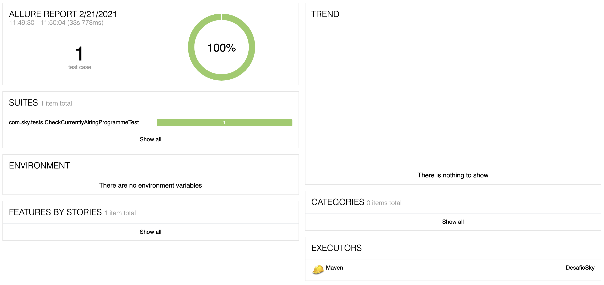
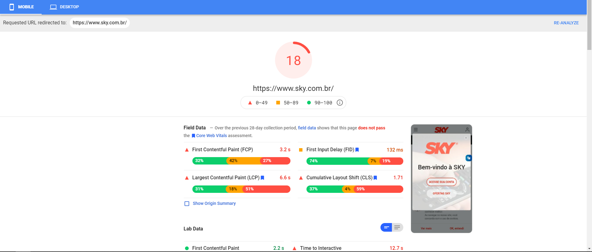
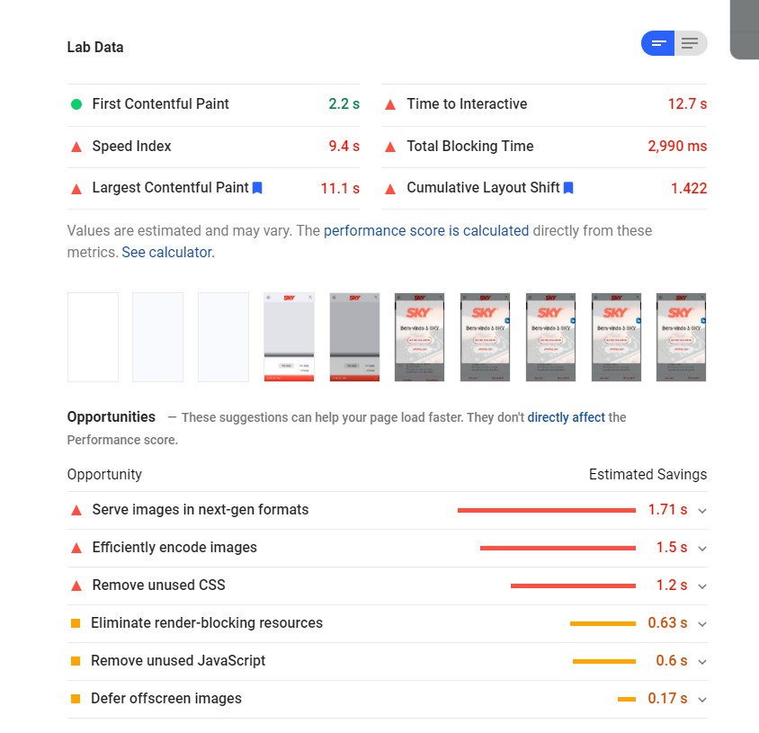
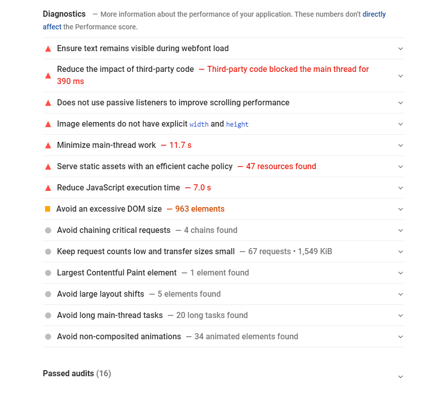
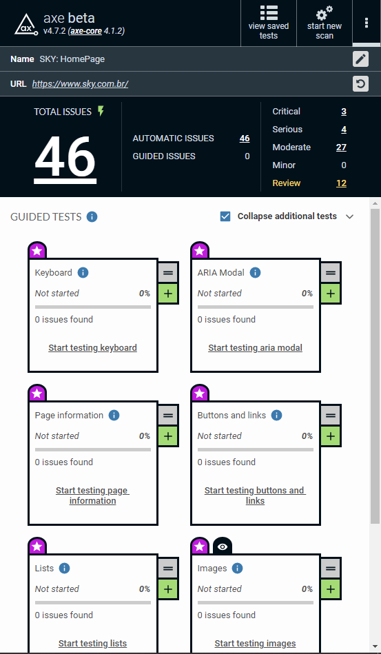
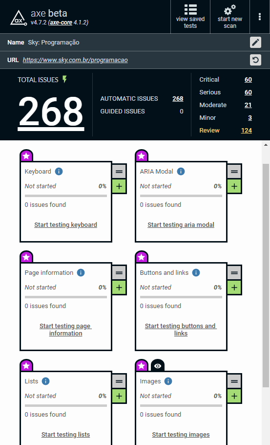

# Introduction
## Presentation
This little test suite consists of a single test developed with Java, using Selenium Framework and the JUnit test engine. To better organise the code, the suite was created following the Page Objects Model, also generating a report with Allure.

## Getting started
### Pre-conditions
1. Make sure that you have Java 8 or newer installed and properly set in the environment variables of your system.
2. On the root of this project, you'll find the Chromedriver v 88 for MacOS x64. Replace it with the correct version for your OS and browser.
3. Close the repository into your desired folder and wait until your IDE indexes all files. I recommend using IntelliJ IDEA.

### Project structure
```
├── DesafioSky.iml
├── README.md
├── chromedriver
├── functionTestReport.png
├── pom.xml
├── report (test report are here)
│   ├── a11yReport
│   │   ├── sky-homepage-https-www.sky.com.br--2021-02-21.json
│   │   ├── sky-programacao-https-www.sky.com.br-programa-2021-02-21.json
│   │   ├── skyHomepageA11y.png
│   │   └── skyProgramacaoA11y.png
│   ├── issues
│   │   ├── nowAiringDisappearsAfter23h.png
│   │   └── thumbnailsAreBroken.png
│   └── pageInsights
│       ├── skydesktop1.png
│       ├── skydesktop2.png
│       ├── skydesktop3.png
│       ├── skymobile1.png
│       ├── skymobile2.png
│       └── skymobile3.png
├── src
│   ├── main
│   │   ├── java
│   │   └── resources
│   └── test
│       ├── java
│       │   └── com
│       │       └── sky
│       │           ├── pages (page objects are here)
│       │           │   ├── Dashboard.java
│       │           │   ├── HomePage.java
│       │           │   ├── ProgramacaoListPage.java
│       │           │   └── ProgramacaoPage.java
│       │           └── tests (test scripts here)
│       │               └── CheckCurrentlyAiringProgrammeTest.java
│       └── resources
│           └── allure.properties
└── target
    ├── allure-results
    │   ├── allure.properties
    │   ├── dd50e036-81c4-401a-85ee-5bf279979a00-result.json
    │   ├── dfe530f3-1a33-4a5a-ae35-c8d8ef94900c-container.json
    │   ├── executor.json
    │   └── f726b681-c075-4297-98d1-1ff2a9843bdb-container.json
    ├── classes
    ├── generated-test-sources
    │   └── test-annotations
    ├── maven-status
    │   └── maven-compiler-plugin
    │       ├── compile
    │       │   └── default-compile
    │       │       └── inputFiles.lst
    │       └── testCompile
    │           └── default-testCompile
    │               ├── createdFiles.lst
    │               └── inputFiles.lst
    ├── site
    ├── surefire-reports
    │   ├── TEST-com.sky.tests.CheckCurrentlyAiringProgrammeTest.xml
    │   └── com.sky.tests.CheckCurrentlyAiringProgrammeTest.txt
    └── test-classes
        ├── allure.properties
        └── com
            └── sky
                ├── pages
                │   ├── Dashboard.class
                │   ├── HomePage.class
                │   ├── ProgramacaoListPage.class
                │   └── ProgramacaoPage.class
                └── tests
                    └── CheckCurrentlyAiringProgrammeTest.class
```

### Running tests
You can run the suite using either one of two methods: \
* Without generating a report:
  1. Open the test file found at `<src/test/java/com/sky/tests/CheckCurrentlyAiringProgrammeTest.java>`
  2. Click Play button found at the declaration of the class.
* Generating a report with Allure:
  1. At the root of the project, open a terminal and input ```mvn clean test allure:report```
  2. After the test finishes running, you can access an HTML version of the report by running the command ```mvn allure:serve```

## Test plan
### Functional tests
The test was created based on the requirement provided by the challenge. After a session-based exploratory test was performed, I decided not to create any other functional tests. As the web application is in production, so the risk of messing with a real business was greater than the benefits of exploring it a bit more. Below, there's an overview report on the test cycle right before submitting the code to the repository.\
 
### Non-functional tests
* **Performance**: no performance tests that accessed service resources were executed for the reasons mentioned in the previous section.
  * **Front-end performance**: using Google PageSpeed Insights, I analysed the performance of the front-end scripting, which yielded the results: 
    * For desktop, the website received a medium performance with a rating of 52/100.\
  \
  \
  
    * For mobile, the website was rated very poorly, receiving only 18/100, impacting the experience of users who mainly use their phones.\
  \
  \
  
  * **Accessibility**: using Axe Accessibility to assess the website, a total of 46 issues were found in the Home. As for the Programação page, the numbers is far greater, with 268 issues found.\
  \
  

You can find these reports in the `report` folder inside the root of the project. Both Axe and PageSpeed Insights offer suggestions on how to solve/improve the website.

### Issues
During exploratory tests, I found two issues that I'd like to point out.
* When accessing the Programação page, the thumbnails for the channels are broken
```
Steps to reproduce:
1. Open www.sky.com.br
2. Click on "Programação"
3. Scroll to the list of channels and programme schedule
```
\
* When opening the programme schedule after 11 PM, the "now airing" pointer disappears, and the "current time" is not displayed, forcing users to figure out how the slider works.
```
Steps to reproduce:
1. After 11 PM, open www.sky.com.br
2. Click on "Programação"
3. Scroll to the list of channels and programme schedule
```

